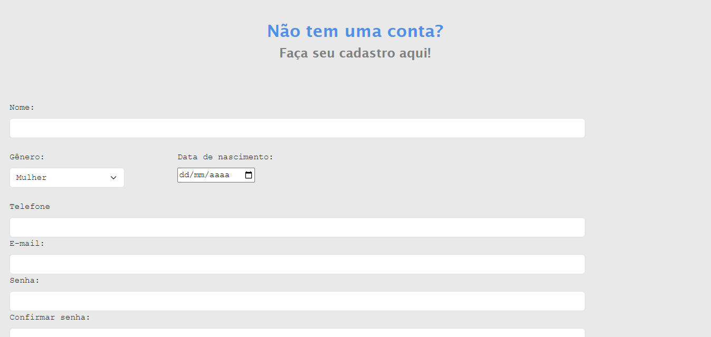

# INDÍCE
[PROJETO FORMULÁRIO DE CADASTRO: Introdução](#projeto-formul%C3%A1rio-de-cadastro-introdu%C3%A7%C3%A3o)
[Funcionalidades](#funcionalidades)  
[Tecnologias utilizadas](#tecnologias-utilizadas)  
[Fontes consultadas](#fontes-consultadas)  
[Autores](#autores)  

# PROJETO FORMULÁRIO DE CADASTRO: Introdução

Anteriormente criamos um simples formulário para trbalhar a verificação de senhar, utilizando as tecnologias do Javascript, adicionamos ao formulário a verificação de CEP, o preenchimento automático dos campos de endereço e também a verificação se todos os campos foram preenchidos.

## Funcionalidades
Além das configurações básicas do HTML e CSS, para deixar a página mais agradável estéticamente, usamos alguns recursos de Javascript. Abaixo você encontra quais foram e como cada um atua dentro do código.

### EXPRESSÃO REGULAR
Mas afinal, o que é **expressão regular**? 
De uma forma mais resumida, expressões regulares são como padrões utilizados para selecionar certas combinações de caracteres. Neste código, utilizamos ela para verificar se o que foi digitado tem a quantidade certa de números e se contém apenas números. 

É semelhante a um compartimento com nove entradas. Com a expressão regular indicamos que esse compartimento terá nove entradas e, na segunda linha, que só se pode ocupar oito entradas do compartimento (número de digitos de um CEP) com números apenas. 

### STRICT MODE

No início do código em JavaScript, determinamos que estariamos usando o **strict mode**, o que isso beneficia no código? O strict mode sinaliza potenciais problemas encontrados na aplicação e identifica caso haja algo perigoso ou que pode gerar erros, usando o strict mode o código nem executará se identificar algo de errado.

### VERIFICAÇÃO

Quando o usuário clicar no botão de caastrar a função de verificar vai analisar se todos os campos ditos como obrigatórios foram digitados e se as senhas foram iguais, para isso demos o nome do id de cada campo e depois usando **IF** e **ELSE** declaramos que só seria aceito caso todos fossem preenchidos, o mesmo com as senhas.

### VALIDANDO O CEP

**async e await**  
A função de PesquisarCep é dita como assíncrona, mas afinal, o que seria uma função assíncrona? 
Antes de tudo é preciso relembrar que uma função síncrona é executada em tempo real, uma função assíncrona seria o oporto disso.

No código, o async e o await trabalham juntos, de certa forma. A função async executa e o await faz essa execução pausar. No nosso caso, a funçao async serve para declarar onde seria consultado o CEP, no site da viacep, e o await da uma pequena pausa nessa tarefa para verificar se o CEP é válido.

 **fetch**  
Agora que sabemos onde é consultado o CEP, é preciso fazer uma ligação entre o nosso site e o site da viacep. O elemento fetch é quem faz essa ligação. 

 **hasOwnProperty**  
Após criarmos essa ligação, foi usado o hasOwnProperty para verificar se o que foi digitado existe ou não, ele verifica dentro da variável e depois retorna um alert dependendo do resultado.É como se o fetch começasse o trabalho e o hasOwnProperty terminasse. 

### LIMPAR E PREENCHER FORMULÁRIO

**addEventListener('focusout')**  
Quando o CEP for validade e os campos forem preenchidos automaticamente, ao passar de um campo para o outro, o formulário limpa antes de preencher com novas informações. Explicando brevemente, adicionamos um evento ao código utlizando o **addEventListener** e especificamos qual evento seria, usando o **focusout**, que atua quando o foco saí da linha selecionada, enquanto a linha estiver selecionada nada irá acontecer. 

## Tecnologias utilizadas
Neste projetos tivemos o uso de:
* HTML 5 
* JAVASCRIPT
* GIT 
* GITHUB
* BOOTSTRAP 5
* CSS

## Fontes consultadas
[Acessando o webservice de CEP](https://viacep.com.br/)
[Crie sua SHEIN conta](https://br.shein.com/user/auth/login?direction=nav)
[Registro - ZARA Brasil](https://www.zara.com/br/pt/signup)
[Registro na Amazon](https://www.amazon.com.br/)
[Expressões Regulares](https://developer.mozilla.org/pt-BR/docs/Web/JavaScript/Guide/Regular_expressions)
[Strict mode](https://developer.mozilla.org/pt-BR/docs/Web/JavaScript/Reference/Strict_mode)

## Autores
Sarah Ozeto, com a orientação do professor Leonardo Rocha e auxílio de Nathan Oliveira Fabrício. 